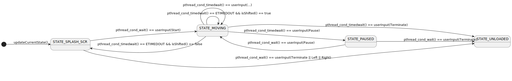
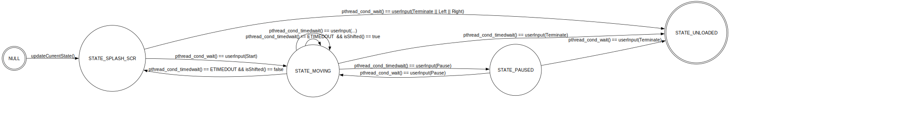

Doxygen documentation {#mainpage}
=========

## Цель реализации проекта
    1. Научиться работать с динамическими библиотеками
    2. Научиться проектировать программы на основе конечных автоматов

## Задача
    1. Реализовать библиотеку игры "Tetris", управляемую двумя асинхронными функциями.
    2. Реализовать эмулятор игровой приставки "Brick Game", способный динамически загружать различные библотеки с играми.

Для унификации игр управление в них должно быть основано на функциях `userInput(UserAction_t,bool)` и `updateCurrentState()`:

@include brick_game/brickgame.h 

## Google style

В Google Style Guide для C++ и C рекомендации по стилю именования следующие:
 * Every file should contain license boilerplate
 * All header files should have #define guards to prevent multiple inclusion. The format of the symbol name should be <PROJECT>_<PATH>_<FILE>_H_
 * VariableCase: lower_case
 * FunctionCase: CamelCase
 * TypedefCase: CamelCase
 * ConstantCase: CamelCase
 * EnumConstantCase: CamelCase
 * ConstantPrefix: k 
 * EnumConstantPrefix: k
 * MacroDefinitionCase: UPPER_CASE
 * NamespaceCase: lower_case
 * ConceptCase: CamelCase
 * MemberCase: lower_case
 * ClassMemberSuffix: _

## Примечания

### При разработке я придерживался Google Style Guide со следующими изменениями:
 * The format of the header files #define guards is equal to MacroDefinitionCase: UPPER_CASE and 
 * FunctionCase: camelBack
 * ConstantPrefix: '' 
 * EnumConstantPrefix: '' 
 * TypedefSuffix: _t

### Библиотека игры тетрис реализована с использованием конечного автомата:

